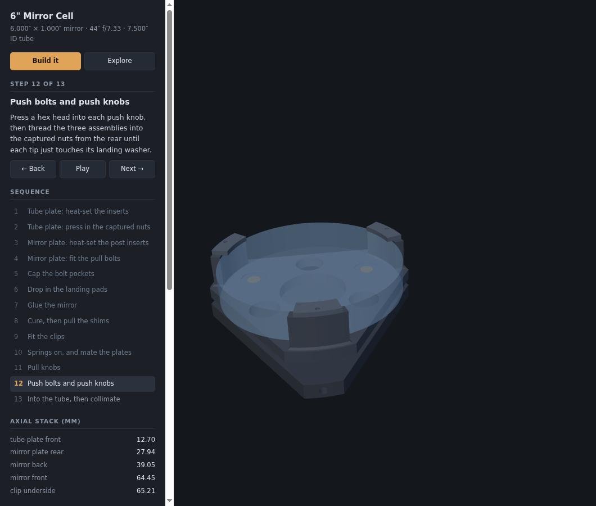

# Mirror Cell — 6" and 8"



A 3-point primary mirror cell — 3D printed in black ABS, assembled with 10-24 hardware.
Two telescopes are built from one model:

| | Mirror | Tube ID | Build | Buy list |
|---|---|---|---|---|
| **6"** (default) | 6.000" × 1.000", f/7.33 | 7.500" | `build/` | `BOM.md` |
| **8"** | 8.000" × 1.330" | 10.000" | `build-8/` | `BOM-8.md` |

The 6" is the original and the only one that has been printed and measured. The 8" is the
same cell with three numbers changed — see
[ADR-0003](./docs/adr/0003-the-8-inch-cell-is-the-same-cell-parameterised.md) for what
scales, what deliberately does not, and why it stops at two entries.

| File | Purpose |
|---|---|
| `HANDOFF.md` | **Start here when resuming** — state, blockers, and the traps |
| `BOM.md`, `BOM-8.md` | The buy lists, annotated. Generated — `--check` fails if one goes stale |
| `CONTEXT.md` | Glossary. Tube plate, Mirror plate, Station, Support point, Silicone dab, … |
| `mirror-cell-spec.md` | The design, its numbers, and the reasoning behind them (written for the 6") |
| `docs/adr/0001-…md` | Why the support points sit at 0.75R rather than the PLOP optimum |
| `docs/adr/0002-…md` | Why both rear controls are printed knobs clearing each other radially |
| `docs/adr/0003-…md` | Why the 8" cell is a config entry rather than a second design |
| `mirror_cell.py` | The model. All dimensions are named variables at the top |
| `test_coupon.py` | The ABS test coupons — the print that dials `FIT` |
| `TEST-COUPON.md` | How to print them, how to read them, where the answer goes |
| `index.html` | Assembly viewer — assembled/exploded, in the browser |
| `90866A011_….STEP` | Vendor wing-nut solid (McMaster). No longer part of the design — kept as ADR-0002's evidence |

## Build the geometry

```sh
python3 mirror_cell.py                # the 6" cell  -> build/,   BOM.md
python3 mirror_cell.py --aperture 8   # the 8" cell  -> build-8/, BOM-8.md
```

Runs 171 assertions **for the cell selected**, then writes `*.step`, `*.stl`, `3mf/*.3mf`
(geometry **and** that part's slicer settings), `assembly.json` and the bill of materials
— `bom.md`, `bom.csv`, and the committed snapshot at the top level (the build directories
are gitignored, so those snapshots are the copies the repo carries). If a BOM row changed,
the snapshot is rewritten and the run says which rows moved — **commit it**. To check
without writing anything:

```sh
python3 mirror_cell.py --check
python3 mirror_cell.py --aperture 8 --check
```

which verifies and then *refuses* a stale snapshot instead of repairing it. That is the CI
entry point, and the one to run on a fresh checkout — **run it for both apertures**, since
each one only checks the cell it was asked for.
The assertions encode the spec — the three gaps that must never close, both fastener
bearing floors, assembly clearances, spring travel, post placement, and printer bed fit.
**If a check fails, the geometry is wrong; do not print it.** Several real defects were
caught this way rather than at the print bed — including a version whose mirror could
never have been installed, because the clips were printed onto the posts.

Requires `build123d` (`pip install --user build123d`).

## View it

The page fetches STLs, so it needs to be served over HTTP — `file://` will not work.

```sh
python3 -m http.server 8018
# then open http://localhost:8018/          the 6" cell
#           http://localhost:8018/?cell=8   the 8" cell
```

`?cell=8` reads `build-8/` instead of `build/`, so run the exporter for that aperture
first or the page has nothing to fetch. The coupons are shared and always come from
`build/`.

Two modes:

- **Build it** — steps through the 13-stage assembly sequence. Parts fly in as they are
  fitted, the mirror-plate sub-assembly is held clear while it is worked on, and the
  shims come back out at step 8. Each step carries its instructions, and the
  order-critical ones carry a caution. Prev/Next, a Play button, ←/→ keys, and a
  clickable step list. Linkable as `#step=7`.
- **Explore** — the explode slider and per-part visibility toggles.

The last step drops the cell into a **transparent stub of the sonotube** (7.750″ OD,
0.125″ wall, reaching 3.65″ behind the tube plate and 2″ above the mirror) with a 40 mm
fan on the rear face, so the finished assembly can be seen in context. Both are display
only and can be switched off in Explore. **The fan is a stand-in drawn in `fan()`,
not a vendor solid** — trust its envelope, not its details.

Under both is a **Downloads** panel. First the **annotated bill of materials** — MD or
CSV — which is not a hand-maintained table: `bom()` in `mirror_cell.py` counts the printed
quantities off the same instance lists the picture uses, reads every hardware dimension
out of the parameters, and carries one line of *why* for each row (machine screws not cap
screws, springs by geometry not by rate, fender washers on the outside). Assertions check
that it lists every printed part, agrees with the download list part for part, buys
exactly the nuts, washers, springs and screws the model draws, and leaves no row
unannotated. Below it is every printed part and both test coupons, each with its STEP, its
**3MF** and (smaller) its STL. The 3MF is the one to print: a solid in real units that
also carries that part's walls, top/bottom shells and infill, so it slices without being
dialled in. They ride as **per-object overrides** in `Metadata/model_settings.config`, an
Orca/Bambu-family convention rather than anything in the 3MF standard — the core spec has
no notion of a perimeter count — so in Cura and friends the file opens as plain geometry
and the settings are ignored. **Select your own process preset first**, at 0.2 mm layers:
the overrides sit on top of it and move only the part-specific keys, so your speeds,
accelerations and temperatures are the ones you chose, and they survive switching presets.
Layer height is deliberately *not* in the file — it has no per-object form, and the shell
counts are layer counts that only buy the intended thickness at 0.2 mm. `verify()` checks the settings data, and after writing, each
file is reopened and its config compared with what the model meant, because seven files
with no settings in them look exactly like seven correct ones from the outside. That list
is generated — printed parts from `assembly.json`, coupons from `coupons.json` — so it
cannot offer a file the exporter does not write, and an assertion checks that it names
every part in `PARTS` with the right quantity. The coupon rows appear once `test_coupon.py` has been
run; until then the panel says so. `build/` is gitignored, so the files are whatever your
last run produced.

Drag to orbit, scroll to zoom, right-drag to pan. The picture at the top of this file is
that page, on step 12 of the 6" sequence.

**The instructions are not written in the HTML.** `sequence()` in `mirror_cell.py` emits
them alongside the geometry, and assertions check that every step names a part that
actually exists and that the last step shows the finished cell. Instructions and parts
cannot drift apart.

three.js is vendored under `js/vendor/` (copied from `~/dob`); there is no CDN or network
dependency, and no STL loader — `parseSTL` reads build123d's binary STLs directly.

## One source of truth

Every position in the viewer comes from the selected cell's `assembly.json`, which
`mirror_cell.py` writes from the same variables that cut the geometry. No dimension is
typed into the JavaScript, so the picture cannot drift away from the parts — and the
same page draws either cell without knowing anything about apertures.

## Status

No cell part has been printed yet, but **both coupons have.** The fit coupon (2026-07-28)
gave 0.7–0.9 % measured shrink and put the captured nut on the 0.10 rung, so
`FIT_PRESS = 0.10`. The insert coupon (2026-07-29) passed on both 10-24 bores, the 3.05 mm
roof and the M3 bores in the rib, with the `insert_solid` modifiers in place —
`INSERT_BORE_D = 6.5` stands as drawn. **The tube plate is cleared to print.**

The mirror plate still waits on `FIT_SLIP = 0.20`, which is predicted from the shrink
rather than measured — one 10-24 hex bolt in row H of the coupon settles it. And the insert
coupon has not been *sectioned*, which is the only way to confirm the modifier put solid
material around the bore in the plastic rather than only in the file. See
[TEST-COUPON.md](./TEST-COUPON.md).

The rear end was reworked afterwards ([ADR-0002](./docs/adr/0002-both-rear-controls-are-printed-knobs.md)):
both controls are printed knobs that clear each other radially, the wing nut is gone, and
all six bolts are 10-24 × 1½″ machine screws. Print one pull knob and press a nut into its
2.2 mm wall before committing to six. Plate and knob outlines are functional but
aesthetically provisional.

**Nothing of the 8″ cell has been printed at all.** Its 171 checks pass and it shares the
6″ cell's measured fits, so the coupon work carries over — but its tube plate is
237 × 207 mm on a 250 mm bed with only a 5 mm brim, and warp on a plate that size is the
one risk no assertion covers. Print that plate first.
